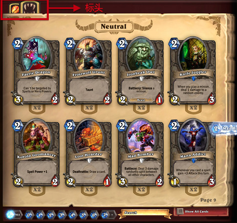
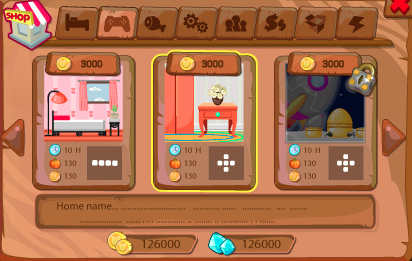
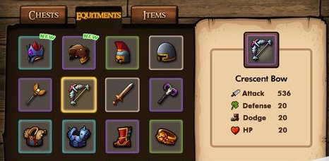
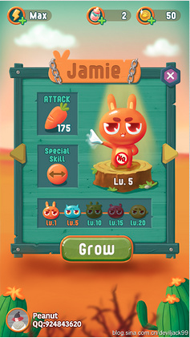

#多行多列带标头能翻页的TableView

##需求

在游戏中需要实现如下效果

这个特征如下：

1. 带标头，每个标头对应一个种类，每个种类可以有无数项，但是显示的时候每次只显示一部分，可以多行多列，也可以单行单列。
2. 能够左右翻页或上下翻页
3. 能上下滑动或左右滑动
4. 显示的内容可以超过显示区域，通过滑动滚动条来显示遮盖的信息
5. 可以带背景图也可以不带
6. 显示当前显示的是第几页
7. 当点按标头，切换到别的种类，再切换回来，还显示最后切换回来种类，最后显示的内容
8. 有翻页指示箭头

实现上面的效果，很自然会想到Cocos2d-x的TableView，但是这个太基本了，要自己写的太多，本着能不写就不写的原则，上网翻了一下，找到这个文章[《Cocos2d-x之TableView和ScrollView的混合使用》](http://cn.cocos2d-x.org/tutorial/show?id=2252)，实践了一下，因为这个在设计时估计就没考虑多行多列，所以要加多行多列也要写不少，并且这个实现，因为每个标头（种类）对应一个TableView，如果种类多，要创建多个TableView，对需要显示多个种类的应用不是很经济，就放弃了，再在网上找别的，没有找到，就只能自己写了，这里写这一段，是因为自己写的时候，在上下左右的手势处理上是借鉴这个文章的，所以只有感谢作者的无私奉献了。

##实现

本计划在TableView基础上做扩展，但是看TableView各种绕来绕去，衡量了下，如做扩展，要理顺的地方太多了，不如直接另起炉灶吧，因为TableView的设计还是不错的，在显示的时候，只根据显示区域生成有限个的TableViewCell，如果上下滑动，有数据更新，只更新已创建，但不用的TableViewCell，让它再显示就可以了，这个实现比较经济，于是仿照这个设计思路。

###具体实现看下面的视频
<iframe frameborder="0" width="640" height="498" src="http://v.qq.com/iframe/player.html?vid=s0158tm8cmf&tiny=0&auto=0" allowfullscreen></iframe>

###实现说明
1. 需求部分提到的基本都有实现
2. 设计的时候就按多行多列和多种类设计的，所以处理这类需求完全能胜任
2. 按TableView设计思路，实际创建的TableViewCell并不多，所以比较经济
3. 对显示布局相同的种类做了归纳处理，即显示布局相同的TableView，会共用一个TableView，比较经济

##应用
这个在游戏中用到的地方比较多，比如类似如下界面都可实现

##代码
###说明
1. 实现是在cocos2d-x 3.3版本
2. 因为后来需求变更，这个控件直接不用了，所以没有完善、没有细化、没有优化、有些功能没有实现，比如处理是左右滑动还是上下滑动的开关逻辑
3. 没有注释、没有说明
4. 可能有些地方有坑，因为这个控件后来不用了，所以有些释放资源的地方，只简单标记，没实际处理
5. 虽然有以上问题，但是代码可用性还是很高的，这个通过上面视频演示就可得出
6. 后续会完善代码，但不确定时间

###代码地址

查看代码：[点这里](https://github.com/sunjianhua/TablePageView) 

[TablePage](https://github.com/sunjianhua/TablePageView/tree/master/TablePage)目录下为控件实现文件

[Restaurant.h](https://github.com/sunjianhua/TablePageView/blob/master/Restaurant.h)/[Restaurant.cpp](https://github.com/sunjianhua/TablePageView/blob/master/Restaurant.cpp)为使用控件的示例代码

如果用Restaurant做测试，只要把代码文件加载到项目，在显示层的init()文件加下面一句：
addChild(Restaurant::create());
然后运行应该就看到效果了。
